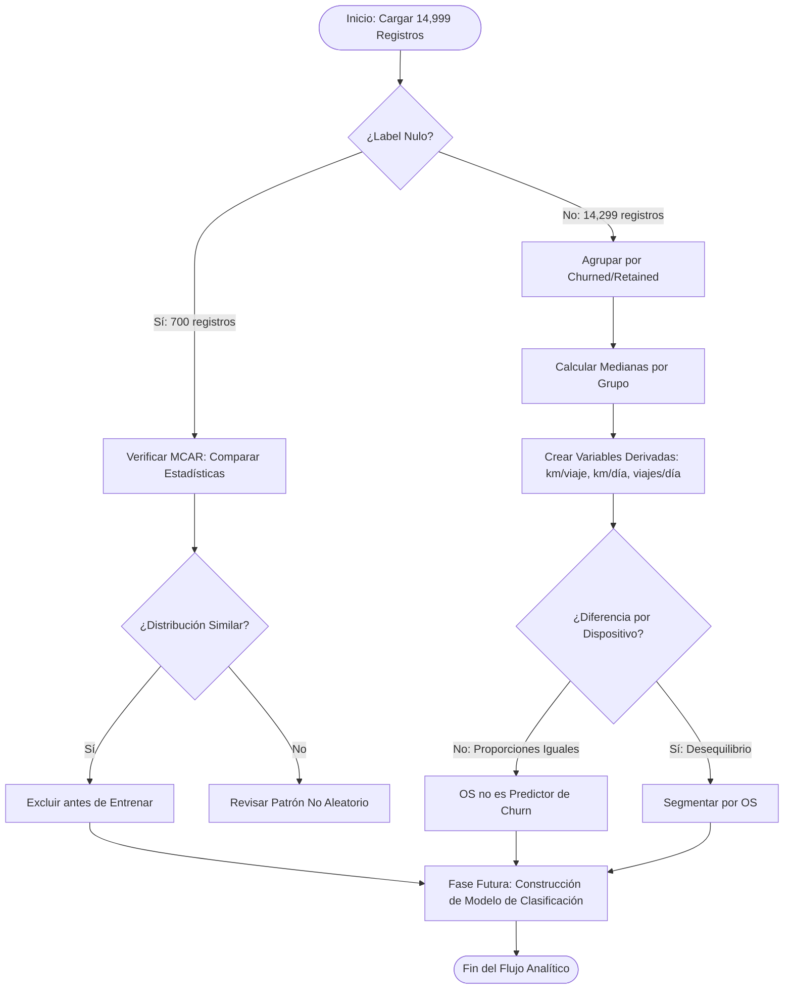

# 🚗 Proyecto Waze — Análisis de Abandono de Usuarios (Churn)

Este repositorio contiene la fase inicial del proyecto de análisis de datos desarrollado para **Waze** con el objetivo de identificar los comportamientos y patrones de uso correlacionados con la deserción o abandono (*churn*) de usuarios. El análisis exploratorio (EDA) y la ingeniería de variables establecen las bases analíticas necesarias para el desarrollo posterior de un modelo predictivo de clasificación que permita anticipar qué usuarios tienen mayor riesgo de abandonar la plataforma.

El proyecto se estructuró bajo el marco de resolución de problemas **PACE** (*Plan, Analyze, Construct, Execute*).

---

## 📋 Estructura del Repositorio y Guía de Inicio

Para comprender y reproducir este análisis de forma óptima, se recomienda explorar los archivos en el siguiente orden:

1. **[requirements.txt](requirements.txt)**: Archivo con las dependencias del sistema y librerías necesarias con sus respectivas versiones para garantizar la reproducibilidad del entorno de ejecución.
2. **[Waze_Laboratorio_Python_ES.ipynb](Waze_Laboratorio_Python_ES.ipynb)**: Cuaderno de Jupyter principal. Contiene el código en Python estructurado paso a paso para la carga, inspección de valores nulos, análisis exploratorio, cálculo de métricas derivadas y síntesis de hallazgos. **Este es el archivo principal a abrir.**
3. **[waze_dataset.csv](waze_dataset.csv)**: Conjunto de datos original en formato CSV que contiene una muestra de 14,999 registros de usuarios con 13 variables analíticas de actividad vial mensual.
4. **[images/](images/)**: Carpeta que contiene los recursos visuales y esquemas metodológicos que guían el flujo de trabajo de la metodología PACE.

---

## 🎯 Objetivos del Proyecto

1. **Exploración y Diagnóstico (EDA):** Analizar y validar la calidad del conjunto de datos, aislar e investigar los 700 valores nulos en la variable objetivo (`label`) y caracterizar su naturaleza (MCAR).
2. **Identificación de Patrones de Abandono:** Comprender las diferencias de uso y movilidad entre usuarios retenidos (`retained`) y aquellos que abandonaron la plataforma (`churned`) mediante medianas y proporciones.
3. **Preparación Analítica:** Definir los criterios de limpieza, crear variables derivadas útiles (km por viaje, km por día de conducción, viajes por día) y estructurar los datos para el modelado predictivo de clasificación.

---

## 📊 Diagnóstico y Estadísticas Clave de los Datos

La exploración inicial del dataset reveló las siguientes estadísticas descriptivas fundamentales:

* **Volumen y Completitud:** El dataset consta de **14,999 registros y 13 columnas**, con **700 valores nulos** exclusivamente en la columna `label` (~4.7% del total).
* **Distribución de la Variable Objetivo (`label`):**
  * `retained`: **11,763 usuarios** (82.3% de la muestra con etiqueta).
  * `churned`: **2,536 usuarios** (17.7% de la muestra con etiqueta).
* **Distribución de Dispositivos (`device`):**
  * `iPhone`: **9,225 usuarios** (64.5% del total).
  * `Android`: **5,074 usuarios** (35.5% del total).

> [!NOTE]
> Los 700 registros sin etiqueta (`label`) tienen una distribución de variables estadísticamente indistinguible del resto del dataset. La proporción de dispositivos entre los nulos (63.9% iPhone / 36.1% Android) es consistente con la del dataset completo. Esto sugiere una ausencia **MCAR** (*Missing Completely At Random*), por lo que estas filas deben excluirse antes de entrenar cualquier clasificador predictivo.

---

## 📈 Resumen de Hallazgos y Métricas Clave

A partir del análisis exploratorio realizado en el notebook, se identificaron los siguientes patrones críticos:

### ⚡ El Comportamiento del "Súper Conductor" (Usuarios Churned)

Los usuarios etiquetados como `churned` presentan un comportamiento de conducción extremadamente intensivo en comparación con los usuarios retenidos:

| Métrica | Churned (mediana) | Retained (mediana) | Diferencia |
| --- | --- | --- | --- |
| **km por día de conducción** | 697.54 km | 289.55 km | **+240%** |
| **Viajes por día de conducción** | 10.00 | 4.06 | **+146%** |
| **Días de actividad en el mes** | 8 días | 17 días | **-53%** |
| **Días de conducción en el mes** | 6 días | 14 días | **-57%** |

**Interpretación:** El usuario que abandonó condujo distancias significativamente mayores en muchos menos días, concentrando su uso en sesiones intensas pero esporádicas. A pesar de recorrer más distancia y hacer más viajes, abrió la aplicación aproximadamente la mitad de días en el mes comparado con el grupo de retenidos.

### 📱 Análisis por Dispositivo Móvil

No se detectó un desequilibrio estadístico significativo en el abandono según el sistema operativo:

| Dispositivo | % en Churned | % en Retained | % en Dataset Completo |
| --- | --- | --- | --- |
| **iPhone** | 64.87% | 64.44% | 64.48% |
| **Android** | 35.13% | 35.56% | 35.52% |

*Conclusión:* El sistema operativo no es un factor correlacionado con el abandono de usuarios. La proporción se mantiene casi idéntica en ambos grupos.

---

## 💡 Conclusiones y Recomendaciones de Negocio (Insights para Waze)

Tras concluir el análisis exploratorio, se presentan las siguientes conclusiones clave orientadas al negocio:

### 1. El Perfil de "Súper Conductor" es una Señal Temprana de Riesgo

Existe una correlación contraintuitiva entre la intensidad de uso y la probabilidad de abandono: **los usuarios que más usan la app en términos de distancia y viajes por sesión son los que más tienden a irse**. Este patrón sugiere que los "súper conductores" —posiblemente conductores profesionales, de larga distancia o de reparto— tienen necesidades específicas que Waze no está satisfiriendo.

**Recomendación:** Implementar un sistema de detección temprana que identifique usuarios con baja frecuencia de apertura (< 10 días/mes) combinada con alta intensidad de uso (> 500 km/día de conducción) y activar intervenciones proactivas como encuestas de satisfacción, notificaciones push personalizadas o programas de fidelización segmentados.

### 2. El OS No es Predictor de Churn — No Diferenciar por Plataforma

Dado que la tasa de abandono es prácticamente idéntica entre iPhone (64.87%) y Android (35.13%) dentro de cada grupo, y coincide con la distribución general del dataset, **no hay justificación para invertir recursos en diferenciación de estrategias por sistema operativo**. El problema de retención es transversal y apunta a la experiencia de uso, no a la compatibilidad técnica.

**Recomendación:** Centrarse en mejoras de producto y experiencia de usuario aplicables a ambas plataformas en lugar de desarrollar soluciones específicas por OS.

### 3. Se Requieren Datos Cualitativos sobre los "Súper Conductores"

El análisis cuantitativo identifica el patrón, pero no explica la causalidad. No se sabe si estos usuarios abandonan porque la app no satisface sus necesidades de navegación profesional, porque migran a competidores con funciones específicas (rutas comerciales, gestión de flotas), o por factores externos al producto.

**Recomendación:** Waze debería complementar este análisis con investigación cualitativa — entrevistas, encuestas o focus groups dirigidos específicamente a usuarios con el perfil de "súper conductor" — para entender las razones reales detrás del abandono y diseñar soluciones informadas.

---

## 🛠️ Metodología PACE Aplicada

El flujo del proyecto se divide en fases ejecutadas en este repositorio y las planificadas a futuro para completar el desarrollo del modelo predictivo:

### 1. ✅ Plan (Fase Completada)

* Se definieron las preguntas de negocio de Waze sobre el abandono de usuarios y se delimitó el alcance analítico.
* Se revisó el diccionario de datos y se identificaron las 13 variables de entrada del dataset y sus tipos de datos correspondientes.

### 2. ✅ Analyze (Fase Completada)

* Se cargaron los datos en Python y se evaluó la completitud del dataset (700 nulos en `label`).
* Se aislaron los valores nulos y se verificó su naturaleza MCAR comparando estadísticas resumidas y distribución de dispositivos.
* Se calcularon medianas por grupo (churned vs retained) para km por día de conducción, viajes por día y días de actividad.
* Se generaron las conclusiones descriptivas y los insights de negocio ("súper conductor" y análisis por dispositivo).

### 3. ⏸️ Construct (No Aplica en Esta Fase)

* La etapa Construct del marco PACE fue marcada como "no aplica" para este flujo de trabajo específico del notebook, ya que la ingeniería de variables (km por viaje, km por día, viajes por día) se realizó dentro de la fase Analyze como parte del EDA.
* **Plan futuro:** Se crearán características adicionales para el modelado (segmentación por antigüedad, frecuencia de uso de rutas favoritas, etc.) antes del entrenamiento del clasificador.

### 4. ⏳ Execute (Plan de Acción Futuro)

* Se eliminarán los 700 registros con `label` nulo antes de cualquier entrenamiento.
* Se entrenará y validará un modelo de clasificación predictivo (Random Forest, Logistic Regression o XGBoost) utilizando `scikit-learn`.
* Se presentará el rendimiento del modelo final y las recomendaciones de retención a las partes interesadas de Waze.

### Diagrama de Decisiones del Flujo Analítico

El siguiente diagrama detalla cómo se bifurca el procesamiento de datos durante el análisis exploratorio y la preparación para el modelado:



---

## ⚙️ Requisitos e Instalación

### 1. Clonar el repositorio

```bash
git clone https://github.com/NilsonPM/Laboratorio-del-proyecto-Waze.git
cd Laboratorio-del-proyecto-Waze
```

### 2. Instalar dependencias

Asegúrate de tener instalado Python 3.7+ y ejecuta el siguiente comando para instalar las librerías necesarias especificadas en [requirements.txt](requirements.txt):

```bash
pip install -r requirements.txt
```

### 3. Iniciar Jupyter Notebook

Una vez instaladas las dependencias, inicia tu servidor local y ejecuta el notebook:

```bash
jupyter notebook
```

Abre el archivo [Waze_Laboratorio_Python_ES.ipynb](Waze_Laboratorio_Python_ES.ipynb) para visualizar el análisis completo.

---

## 👤 Autor y Contacto

Este proyecto fue desarrollado como parte de un portafolio profesional en ciencia de datos.

* **Portafolio Personal:** [nilsonpineres.me](https://nilsonpineres.me)
* **LinkedIn:** [Nilson Piñeres](https://www.linkedin.com/in/prs-mtz)
* **GitHub:** [@NilsonPM](https://github.com/NilsonPM)
